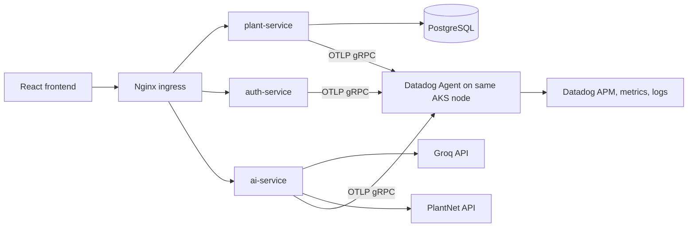

# OpenTelemetry and Datadog Monitoring

## Target Architecture

The application services emit vendor-neutral OpenTelemetry telemetry and the AKS node-local Datadog Agent forwards it to Datadog.



## What Is Instrumented

- FastAPI inbound requests for `auth-service`, `plant-service`, and `ai-service`.
- SQLAlchemy database calls from services that use `common.database`.
- Outbound HTTP calls made through `requests`, including Groq and PlantNet.
- OTLP metrics export from the Python SDK.
- Container logs through the Datadog Agent Helm chart.

## Deployment Flow

1. Add Datadog credentials to Terraform variables:

   ```bash
   terraform -chdir=K8s apply \
     -var='datadog_api_key=<your-datadog-api-key>' \
     -var='datadog_site=datadoghq.com'
   ```

   Use `datadoghq.eu`, `us3.datadoghq.com`, `us5.datadoghq.com`, or your Datadog site if your account is not on the default US site.

2. Terraform installs the Datadog Helm chart in the `datadog` namespace with OTLP gRPC/HTTP receivers enabled.

3. Argo CD deploys `vhg-chart`. The backend pods use:

   - `OTEL_EXPORTER_OTLP_ENDPOINT=http://$(HOST_IP):4317`
   - `OTEL_EXPORTER_OTLP_PROTOCOL=grpc`
   - `OTEL_DEPLOYMENT_ENVIRONMENT=aks`
   - `OTEL_RESOURCE_ATTRIBUTES=service.namespace=virtual-herbal-garden,...`

4. Generate traffic through the app or APIs. Datadog should show the services as:

   - `vhg-auth-service`
   - `vhg-plant-service`
   - `vhg-ai-service`

## Validation Commands

```bash
kubectl get pods -n datadog
kubectl get pods -n vhg-1
kubectl logs -n datadog -l app=datadog
kubectl describe pod -n vhg-1 -l app=plant-service
```

In Datadog, check APM Services for the three `vhg-*` services and Metrics Explorer for OTel runtime/request metrics.

## Notes

- Keep `observability.enabled=false` in `vhg-chart/values.yaml` for local deployments that do not run an OTLP collector.
- Production sampling should be lowered from `1.0` after baseline validation if trace volume becomes noisy.
- The current Helm secret contains live-looking credentials. Rotate those values and move them to a secret manager or sealed secret before treating this environment as production-grade.
