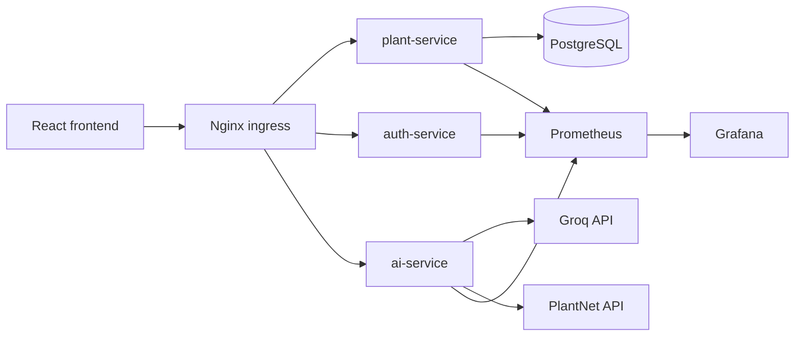

# OpenTelemetry and Prometheus/Grafana Monitoring

## Target Architecture

The application services emit vendor-neutral OpenTelemetry telemetry. Backend services export metrics using the Prometheus OpenTelemetry exporter, and Grafana visualizes metrics from Prometheus.



## What Is Instrumented

- FastAPI inbound requests for `auth-service`, `plant-service`, and `ai-service`.
- SQLAlchemy database calls from instrumented services.
- Outbound HTTP calls made through `requests`, including Groq and PlantNet.
- Prometheus-compatible metrics are exposed from each backend pod on `/metrics`.
- Prometheus scrapes each backend pod directly using PodMonitor annotations.

## Deployment Flow

1. Install the Prometheus/Grafana stack in the cluster.

   ```bash
   helm repo add prometheus-community https://prometheus-community.github.io/helm-charts
   helm repo update
   helm install monitoring prometheus-community/kube-prometheus-stack -n monitoring --create-namespace
   ```

2. Deploy the application via Helm. The backend services expose metrics at:

   - `/metrics` on port `9464`

3. Prometheus discovers the backend pods through PodMonitor resources created by the `vhg-chart` application.

4. Grafana is provided by the same `kube-prometheus-stack` install and can be accessed from the `monitoring` namespace.

## Backend Service Configuration

The backend deployments now expose a Prometheus metrics port using `OTEL_PROMETHEUS_PORT` and a `PrometheusMetricReader` from the OpenTelemetry SDK.

The backend pods also include Prometheus scrape annotations:

```yaml
prometheus.io/scrape: "true"
prometheus.io/port: "9464"
prometheus.io/path: "/metrics"
```

## Validation Commands

```bash
kubectl get pods -n monitoring
kubectl get svc -n monitoring
kubectl get podmonitor -n vhg-1
kubectl port-forward svc/monitoring-grafana 3000:80 -n monitoring
```

Then open `http://localhost:3000` and log into Grafana.

## Notes

- Keep `observability.enabled=false` in `vhg-chart/values.yaml` for local deployments that do not require Prometheus scraping.
- Grafana credentials are stored in the `monitoring` namespace secret created by the Helm release.
- This setup uses OpenTelemetry metrics with Prometheus; frontend browser RUM has been removed from the current observability pipeline.

If you want, I can also add a Grafana ingress and dashboard provisioning next.
